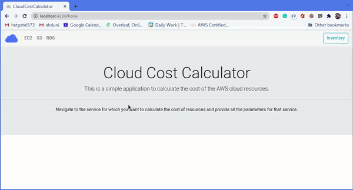

# CloudCostCalculator

This project is a very basic Cloud Cost Calculator. AWS Pricing APIs are utilized to fetch various AWS product's information. User can create their whole AWS cloud inventory and can save it to pdf for organizational use etc. Also the user can generate price report, which gives approximate estimate of their AWS resource costs.

More importantly this project can be used as learning material if anyone wants to explore how to use AWS Javascript SDK and Angular. Currently only EC2, S3 and RDS services are considered. If anyone wants to extend the functionality then please fork and share the idea with me.

## Demo



## Development server

Run `ng serve` for a dev server. Navigate to `http://localhost:4200/`. The app will automatically reload if you change any of the source files. (See [configure](#configure))

## Build

### Configure

In order to use this application you have to generate an IAM user (Programmatic access for API use) with AWSPriceListServiceFullAccess policy attached.

After generation of the user, you will get access key and a secret key which will be used to access AWS Price List API. Run the following command to inject those tokens in code:

```bash
$ ./add_creds.sh <access token> <secret token>
```
> Note: Escape the special characters (precede char with \\) while supplying the parameters in above command.

To clear those tokens from the code run `./add_creds.sh clear`.

### Docker
```bash
$ # Build
$ docker build -t cloud-cost-calculator .
$ # Run
$ docker run -d -p 8080:80 cloud-cost-calculator
```

### Static Deployment files
```
ng build --prod
```
This will produce ./dist/CloudCostCalculator directory which contains javascript bundles and all static files which can be hosted on server.

